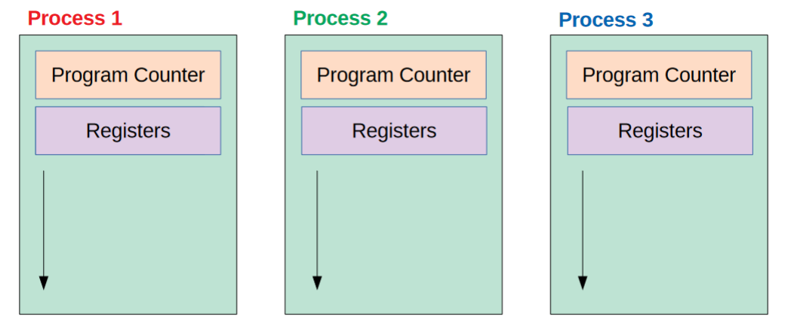

# Computer Systeme


## Index

* [Grundlagen der Befehlszeile](#grundlagen-der-befehlszeile)
* [Hilfe suchen über die Befehlszeile](#hilfe-suchen-über-die-befehlszeile)
* [Verzeichnisse verwenden und Dateien auflisten](#verzeichnisse-verwenden-und-dateien-auflisten)
* [Erstellen, Verschieben und Löschen von Dateien](#erstellen-verschieben-und-löschen-von-dateien)
* [Suchen und Finden von Dateien](#suchen-und-finden-von-dateien)
* [Streams](#streams)
* [Stream Editor sed](#stream-editor-sed)
* [Reguläre Ausdrücke](#reguläre-ausdrücke)
* [Lokale Benutzerverwaltung](#lokale-benutzerverwaltung)
* [Special permissions SUID SGID and sticky bit](#special-permissions-suid-sgid-and-sticky-bit)
* [Benutzer und Gruppen](#benutzer-und-gruppen)
* [Prozesse und Prozessmanagement](#prozesse-und-prozessmanagement)
* [Jobs and Job Control in Bash](#jobs-and-job-control-in-bash)

## Grundlagen der Befehlszeile

#### [Lektion 1](https://learning.lpi.org/de/learning-materials/010-160/2/2.1/2.1_01/)

#### [Lektion 2](https://learning.lpi.org/de/learning-materials/010-160/2/2.1/2.1_02/)

## Hilfe suchen über die Befehlszeile

#### [Lektion 1](https://learning.lpi.org/de/learning-materials/010-160/2/2.2/2.2_01/)

## Verzeichnisse verwenden und Dateien auflisten

#### [Lektion 1](https://learning.lpi.org/de/learning-materials/010-160/2/2.3/2.3_01/)

#### [Lektion 2](https://learning.lpi.org/de/learning-materials/010-160/2/2.3/2.3_02/)

## Erstellen, Verschieben und Löschen von Dateien

#### [Lektion 1](https://learning.lpi.org/de/learning-materials/010-160/2/2.4/2.4_01/)

## Suchen und Finden von Dateien

### Tiefensuche

- `find` Befehl
- Nachteile: Suche ist zeitaufwändig, weil jeder Dateiname auf der Festplatte "angeschaut" werden muss.

### Datenbnkbasiert/Indiziert

- `locate` Befehl
- Vorteile: Deutlich schneller als Tiefensuche
- Nachteile: Es werden nur Dateien gefunden, die in der Datenbank vorhanden sind. Wird eine Datei gelöscht kann es sein, dass sie fälschlicherweise dennoch als existent angezeigt wird.

## Streams

```
Standardinput (stdin/stream 0)
    -> Programm/Skript
        -> Standardoutput (stdout/stream 1)
        -> Standarderror  (stderr/stream 2)
```

### Streams in Dateien umleiten

`stdout` in Datei umleiten

```
befehl 1> Dateiname
befehl > Dateiname
```

`stdout` an Datei anhängen

```
befehl >> Dateiname
```

`stderr` in Datei umleiten

```
befehl 2> Dateiname
```

`stderr` an Datei anhängen

```
befehl 2>> Dateiname
```

Inhalt von Datei als `stdin` verwenden

```
befehl < Dateiname
```

### Pipes (Streams in andere Programme umleiten)

Standardoutput von Programm1 zu Standardinput von Programm2 leiten

```
Prgoramm1 | Programm2
```

## Stream Editor sed

```
sed [options] sed-command [input-file]
```

| Option | Description                             | Example                                      |
| ------ |---------------------------------------- | -------------------------------------------- |
| `-n`   | Suppress default pattern space printing | `sed -n '3 p' config.conf`                   |
| `-i`   | Backup and modify input file directly   | `sed -ibak 's/On/Off/' php.ini`              |
| `-f`   | Execute sed script file                 | `sed -f script.sed config.conf`              |
| `-e`   | Execute multiple sed commands           | `sed -e 'command1' -e 'command2' input-file` |

### Sed commands

| Command | Description                  | Example                                   |
| ------- |----------------------------- | ----------------------------------------- |
| `p`     | Print pattern space          | `sed -n '1,4 p' input.txt`                |
| `d`     | Delete lines                 | `sed -n '1,4 d' input.txt`                |
| `w`     | Write pattern space to file  | `sed -n '1,4 w output.txt' input.txt`     |
| `a`     | Append line after            | `sed '2 a new-line' input.txt`            |
| `a`     | Insert line before           | `sed '2 i new-line' input.txt`            |

### Sed substitute command and flags

```
 sed 's/original-string/replacement-string/[flags]' [input-file]
 ```
 
| Flag             | Description                                 | Example                                                |
| ---------------- |-------------------------------------------- | ------------------------------------------------------ |
| `g`              | Global substitution                         | `sed 's/development/production/g' .env`                |
| `1,2...`         | Substitute the nth occurrence               | `sed 's/latin1/utf8/2' locale.sql`                     |
| `p`              | Print only the substituted line             | `sed -n 's/error_log = 0/error_log = 1/p' php.ini`     |
| `w`              | Write only the substituted line to a file   | `sed -n 's/One/Two/w output.txt' words.txt`            |
| `i`              | Ignore case while searching                 | `sed 's/true/FALSE/i' config.php`                      |
| `e`              | Substitute and execute in the command line  | `sed 's/^/ls -l /e' files.list`                        |
| `/ | ^ @ !`      | Substitution delimiter can be any character | `sed 's|/usr/local/bin|/usr/bin|' paths.list`          |
| `&`              | Gets the matched pattern                    | `sed 's/^.*/<&>/' index.xml`                           |
| `( ) \1 \2 \3` | Group using `(` and `)`.<br>Use `\1`, `\2` in replacement to refer the group | `sed 's/([^,]*),([^,]*),([^,]*).*/\1,\3/g' words.txt` |

### Loops and multi-line sed commands

| Command    | Description                                                        | Example                                         |
| ---------- |------------------------------------------------------------------- | ----------------------------------------------- |
| `b lablel` | Branch to a label (for looping)                                    |                                                 |
| `t lablel` | Branch to a label only on successful substitution<br>(for looping) |                                                 |
| `:lablel`  | Label for the b and t commands (for looping)                       |                                                 |
| `N`        | Append next line to pattern space                                  | `sed = file.txt | sed "N;s/\n/$(printf '\t')/"` |
| `P`        | Print 1st line in multi-line                                       |                                                 |
| `D`        | Delete 1st line in multi-line                                      |                                                 |

### Sed hold and pattern space commands

| Command | Description                                                  |
| ------- |------------------------------------------------------------- |
| `n`     | Print pattern space, empty pattern space, and read next line |
| `x`     | Swap pattern space with hold space                           |
| `h`     | Copy pattern space to hold space                             |
| `H`     | Append pattern space to hold space                           |
| `g`     | Copy hold space to pattern space                             |
| `G`     | Append hold space to pattern space                           |


## Reguläre Ausdrücke

Regular Expressions (regex) sind Zeichenketten, die Zeichenketten beschreiben.

__z.B.__ 
- `Tag` beschreibt die Zeichenkette Tag.
- `[0-3]` eine Zahl zwischen 0 und 3
- `[Tt]` T oder t

```
grep [Tt]est fileName
```

Regex sind universell und werden durch alle gängigen Skript- und Programmiersprachen unterstützt.

__Vorsicht :__ Es gibt verschiedene Dialekte.\
__Vorsicht2:__ Regex können schnell unübersichtlich werden

## Lokale Benutzerverwaltung

### Zugriffsrechte auf Dateien

[Ubuntu Wiki Rechte](https://wiki.ubuntuusers.de/Rechte/)

[Crash Course File & Directory Permissions](https://www.youtube.com/watch?v=4e669hSjaX8)

### Grundsätzliche Forderungen der IT-Sicherheit an Accounts und Passwörter

+ __Probleme mit dem root-Verfahren:__
    + Wenn es mehr als einen Administrator gibt, teilen sich mehrere Personen     ein Password/Account! -> NO GO!
    + Aktionen auf dem System sind nicht auf den Verursacher rückführbar -> NO GO!
    + Jeder, der das Passwort hat und den Account nutzt, hat *alle* Rechte, egal ob er sich braucht oder nicht -> NO GO!
+ __Forderungen der IT-Sicherheit:__
    + Hinter jedem für Menschen zugänglichen Benutzeraccount darf nur *EINE* menschliche Person stehen!
    + Jede Aktion muss (technisch) auf genau diesen EINZELNEN Benutzer zurückführbar sein.
    + Rechte dürfen nur so sparsam wie möglich vergeben werden (d.h. wenn jemand z.B. nur für die Softwareinstallationen zuständig ist, dann darf er keinen Zugriff auf die Benutzeradministration haben)
+ __Lösung der Problematik:__
    + sudo ("Super-User Do")
    + RBAC (Role-based Access Control)
    + Mittlerweile bei gängigen Distributionen der Standard
    + Bei Ubuntu: Erster Benutzer, der angelegt wird ist eine sogenannter "sudoer"
    + Wer sudoers ist, wird in der Datei /etc/sudoers festgelegt
    + Editieren nur mit visudo, nicht mit dem "blanken" vi
    + Vorsicht: Man kann sich "aussperren"!
 
 ## Special permissions SUID SGID and sticky bit
 
There are two special permissions that can be set on executable files: Set User ID (setuid) and Set Group ID (sgid). These permissions allow the file being executed to be executed with the privileges of the owner or the group. Similarly, there are two special permissions for directories: the sticky bit and the setgid bit.

### What is Set User ID (setuid)?

SUID is a special permission assigned to a file. These permissions allow the file being executed to be executed with the privileges of the owner. For example, if a file was owned by the root user and has the setuid bit set, no matter who executed the file it would always run with root user privileges.

### How to set SUID bit on a file?

You must be the owner of the file or the root user to set the setuid bit. Run the following command to set the setuid bit:

```
# chmod u+s file1
```

View the permissions using the ls -l command:

```
# ls -l file1
-rwSrw-r-- 1 user1 user1 0 2017-10-29 21:41 file1
```

Note the __capital S__. This means there are no execute permissions. Run the following command to add execute permissions to the file1 file, noting the __lower case s__.

```
# chmod u+x file1
```
```
# ls -l file1
-rwsrw-r-- 1 user1 user1 0 2017-10-29 21:41 file1
```

Note the lower case s. This means there are execute permissions.

Alternatively, you can set the setuid bit using the numeric method by prepending a 4 to the mode. For example, to set the setuid bit, read, write, and execute permissions for the owner of the file1 file, run the following command:

```
# chmod 4700 file1
```

### What is Set Group ID (setgid) for files?

When the Set Group ID bit is set, the executable is run with the authority of the group. For example, if a file was owned by the users’ group, no matter who executed that file it would always run with the authority of the user’s group.

### How to set the SGID bit for files?

Run the following command as to set the setgid bit on the file1 file:

```
# chmod g+s
```

__Note:__ Both the setuid and setgid bits are set using the s symbol. The setgid is represented the same as the setuid bit, except in the group section of the permissions.

Run the following command as root to set the setgid bit, and read, write, and execute permissions for the owner of the file1 file:

```
# chmod 2700 file1
```

The setgid is represented the same as the setuid bit, except in the group section of the permissions:

```
ls -l file1
-rwx--S--- 1 user1 user1 0 2017-10-30 21:40 file1
```

### What is Set Group ID permissions for directories?

When the setgid bit is set on a directory, all files created within said directory inherit the group ownership of that directory. For example, the folder1 folder is owned by the user user1, and the group group1:

```
# ls -ld folder1
drwxrwxr-x 2 user1 group1 4096 2017-10-30 22:25 folder1
```

Files created in the folder1 folder will inherit the group1 group membership:

```
# touch folder1/file1
# ls -l folder1/file1
-rw-rw-r-- 1 user1 group1 0 2017-10-30 22:29 folder1/file1
```

## How to set the SGID bit for directories?

To set the setgid bit on a directory, use the chmod g+s command:

```
# chmod g+s folder1
```

View the permissions using the ls -ld command, noting the s in the group permissions:

```
# ls -ld folder1
drwxrwsr-x 2 user1 group1 4096 2017-10-30 22:32 folder1
```

Alternatively, prepend a 2 to the directories mode:

```
# chmod 2770 folder1
```

### What is sticky bit on a directory

When the sticky bit is set on a directory, only the root user, the owner of the directory, and the owner of a file can remove files within said directory.

### How to set sticky bit

An example of the sticky bit is the /tmp directory. Use the ls -ld /tmp command to view the permissions:

```
# ls -ld /tmp
drwxrwxrwt  24 root root  4096 2017-10-30 22:00 tmp
```

The __t__ at the end symbolizes that the sticky bit is set. A file created in the /tmp directory can only be removed by its owner, or the root user. For example, run the following command to set the sticky bit on the folder1 folder:

```
# chmod a+t folder1
```

Alternatively, prepend a 1 to the mode of a directory to set the sticky bit:

```
# chmod 1777 folder1
```

The permissions should be read, write, and execute for the owner, group, and everyone else, on directories that have the sticky bit set. This allows anyone to cd into the directory and create files.

### how to find files with SUID/SGID but set

1. To find all the files with SUID but set, use the below command:

```
# find / -perm +4000
```

2. Tofind all the files with SGID bit set, use the below command:

```
# find / -perm +2000
```

You can also combine both the commands to find both SGID and SUID but set files.

```
# find / -type f \\( -perm -4000 -o -perm -2000 \\) -exec ls -l {} \\;
```

## Benutzer und Gruppen

In Debian, there are two command-line tools that you can use to create a new user account: `useradd` and `adduser`.

`useradd` is a low-level utility for adding users while the `adduser` is a friendly interactive frontend to useradd written in Perl.

To create a new user account named `username` using the `adduser` command you would run:

```
$ sudo adduser username
```


Output:

```
Adding user `username' ...
Adding new group `username' (1001) ...
Adding new user `username' (1001) with group `username' ...
Creating home directory `/home/username' ...
Copying files from `/etc/skel' ...
```

You will be asked a series of questions. The password is required, and all other fields are optional.

```
Enter new UNIX password: 
Retype new UNIX password: 
passwd: password updated successfully
Changing the user information for username
Enter the new value, or press ENTER for the default
	Full Name []: 
	Room Number []: 
	Work Phone []: 
	Home Phone []: 
	Other []: 
Is the information correct? [Y/n]
```

On the last prompt you’ll need to confirm that the information is correct by entering `Y`.

The command will create the new user’s home directory, and copy files from `/etc/skel` directory to the user’s home directory. Within the home directory, the user can write, edit, and delete files and directories.

By default on Debian, members of the group sudo are granted with sudo access.

If you want the newly created user to have administrative rights, add the user to the sudo group:

```
$ sudo usermod -aG sudo username
```

### Beispiel

Es werden zwei neue Benutzer angelegt, die einer eigenen ebenfalls neu angelegten Sekundärgruppe angehören.

```
$ sudo adduser newuser1
Adding user `newuser1' ...
Adding new group `newuser1' (1004) ...
Adding new user `newuser1' (1004) with group `newuser1' ...
Creating home directory `/home/newuser1' ...
Copying files from `/etc/skel' ...
Geben Sie ein neues Passwort ein:
Geben Sie das neue Passwort erneut ein:
passwd: Passwort erfolgreich geändert
Benutzerinformationen für newuser1 werden geändert.
Geben Sie einen neuen Wert an oder drücken Sie ENTER für den Standardwert
        Vollständiger Name []: new1
        Zimmernummer []:
        Telefon geschäftlich []:
        Telefon privat []:
        Sonstiges []:
Is the information correct? [Y/n] Y
```

```
$ sudo adduser newuser2
Adding user `newuser2' ...
Adding new group `newuser2' (1005) ...
Adding new user `newuser2' (1005) with group `newuser2' ...
Creating home directory `/home/newuser2' ...
Copying files from `/etc/skel' ...
Geben Sie ein neues Passwort ein:
Geben Sie das neue Passwort erneut ein:
passwd: Passwort erfolgreich geändert
Benutzerinformationen für newuser2 werden geändert.
Geben Sie einen neuen Wert an oder drücken Sie ENTER für den Standardwert
        Vollständiger Name []: new2
        Zimmernummer []:
        Telefon geschäftlich []:
        Telefon privat []:
        Sonstiges []:
Is the information correct? [Y/n] Y
```

```
$ sudo addgroup newgroup1
Adding group `newgroup1' (GID 1006) ...
Done.
```

```
$ sudo usermod -aG newgroup1 newuser1
$ sudo usermod -aG newgroup1 newuser2
```


#### Die Einträge in `/etc/passwd`, `/etc/shadow` und `/etc/group` sehen dann wie folgt aus.


```
$ tail -n 2 /etc/passwd
newuser1:x:1004:1004:new1,,,:/home/newuser1:/bin/bash
newuser2:x:1005:1005:new2,,,:/home/newuser2:/bin/bash
```

```
$ sudo tail -n 2 /etc/shadow
newuser1:$y$j9T$2SK2e7mRHvE/FGiOTtE5A/$zLR0d.9OGRxiAuV5ogsHhprR04n2wURnISq6PwrjtsA:19856:0:99999:7:::
newuser2:$y$j9T$uGUxKRUEMGYN3aTcfUrhg1$nMNYLEOm0KWqlrXH0ra2WllSESTX4YoWvYNc7cdS4cA:19856:0:99999:7:::
```

```
$ tail -n 3 /etc/group
newuser1:x:1004:
newuser2:x:1005:
newgroup1:x:1006:newuser1,newuser2
```

## Prozesse und Prozessmanagement

### What is a process?

+ A process is an instance of a program that is being executed
+ A process may have one or more child processes and be a child of its parent process.
+ Instructions within one process may be executed concurrently by multiple threads.

### Program vs. Process

+ Baking analogy
  + CPU → Baker
  + Input Data → Cake Ingredients
  + Program → Recipe
+ “... a program is something that may be stored on disk, not doing anything.”

### Process Model



### Execution on a Single-Core CPU


### Context Switch

+ A context completely describes a process’s current state of
execution.
  + Program counter
  + Registers
  + Virtual address space
+ During a context switch ...
  + the current process’s execution is suspended
  + the context information for that process is stored
  + the context of the next process is retrieved from memory and restored in
the CPU’s registers
  + the execution of the new process is resumed at the location indicated by
the program counter
+ Hardware context switching
  + Context switch completely performed by CPU hardware
+ Software context switching
  + Context switch performed by the operating system
  + Often preferred for performance and portability reasons
+ Context switches are performed by a component
called dispatcher, which is part of the scheduler. The
dispatcher also alters the flow of execution that is
required in a context switch.

### Processes vs. Threads

+ A single process can have multiple threads.
+ A thread represents a separate, independent, path of execution
within a process.
+ All threads of a process share the process’s address space
(memory).
+ Each thread has its own execution stack
  + Multiple threads can call the execute the same function concurrently
+ Advantages of threads over processes
  + less context switching time
  + easier, more efficient, communication between threads
  + concurrency within a process

### Process-related OS Objectives

+ Maximize processor utilization
+ Allocate resources to processes
+ Prioritize execution
+ Allow for user creation of processes
+ Provide mechanisms for synchronization and
inter-process communication

### Process Control Block (PCB)


### Process States


### Process States on Linux


## Jobs and Job Control in Bash

### Processes and Jobs in bash Shell

A process in Linux means any running program. For example, when we run `ls`, it’s run as a process. If we search for a filename, by using `ls -l` and piping the result to `grep`, we’re actually running two processes:

```bash
$ ls -l | grep script
-rwxr-xr-x 1 ubuntu users 18 Aug  2 21:44 myscript.sh
```