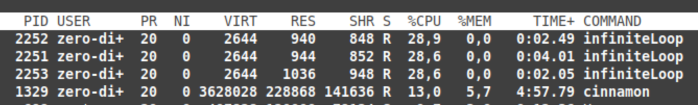
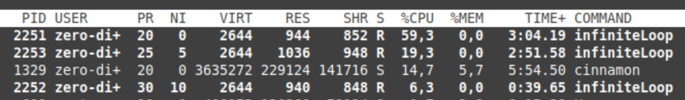

### Programm mit Endlosschleife schreiben, wiederverwenden, verstehen, mehrmals laufen lassen

__Code:__
```c
int main(){
  int i=0;
  while(1){
    i++;
  }
}
```

__Kompilieren unf ausführbar machen:__
```
$ gcc -o infiniteLoop infiniteLoop.c
$ chmod +x infiniteLoop
```

__Mehrfach imHintergrund ausführen__
```
$ ./infiniteLoop &
$ ./infiniteLoop &
$ ./infiniteLoop &
$ ./infiniteLoop &

$ jobs
[1]   Running        ./infiniteLoop &
[2]   Running        ./infiniteLoop &
[3]-  Running        ./infiniteLoop &
[4]+  Running        ./infiniteLoop &
```

### `renice` und `nice` in der Man-Page recherchieren

#### 1. `nice`

```
nice [OPTION] [COMMAND [ARG]...] 
```

Run `COMMAND` with an adjusted niceness, which affects process scheduling. Nicenesses range from -20 (most favorable scheduling) to 19 (least favorable).

__z.B.__
```
nice -n -15 infiniteLoop
```

#### 2. `renice`

`renice` alters the scheduling priority of one or more running processes.

__Wichtige Optionen__

```
--priority priority
       Specify an absolute scheduling priority. Priority is set to
       the given value. This is the default, when no option is
       specified.

--relative priority
       Specify a relative scheduling priority. Same as the standard
       POSIX -n option. Priority gets incremented/decremented by the
       given value.
```

The following command would change the priority of the processes
with PIDs 987 and 32, plus all processes owned by the users
daemon and root:

```
renice +1 987 -u daemon root -p 32
```

#### Useful priorities

* 19 (the affected processes will run only when nothing else in the system wants to)
* 0 (the "base" scheduling priority),
* anything negative (to make things go very fast).

### Bestehenden Prozess (eine Instanz der Endlosschleife) in ihrer Priorität verändern und Verhalten mit top beobachten



```
$ renice +10 -p 2252
2253 (process ID) old priority 0, new priority 10
$ renice +5 -p 2253
2253 (process ID) old priority 0, new priority 5
```

