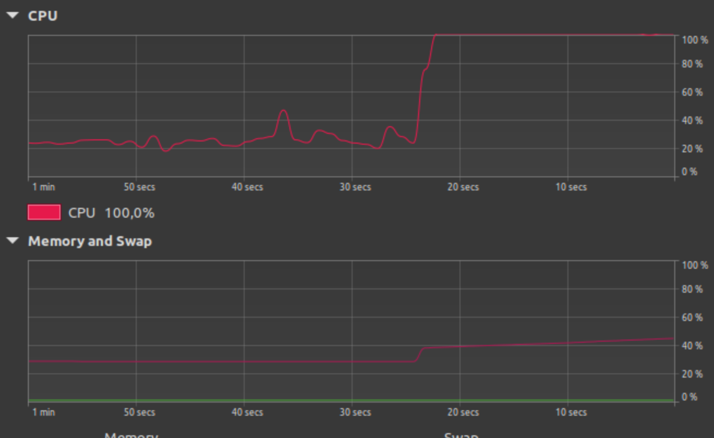

### Make yourself familiar with the following Unix/Linux tools.

+ __ps:__ Zeigt laufende Prozesse an.
+ __pstree:__ Zeigt laufende Prozesse als Baum an.
+ __top, htop:__ Zeigt laufende Prozesse in echtzeit an. Hat auch Prozessverwaltungsfunktionen.
+ __GUI system resource monitor:__ Gleich wie top/htop aber mit gui.

### Find out how you can use ps to identify and display

__the PID of a process with a certain name__

```
ps -C <prozessname> -o pid=<Spaltenüberschrift>
```

+ `-C` wählt nach Befehlsnamen aus.\
+ `-o` legt das benutzerdefinierte Format fest.\
+ `pid=<Spaltenüberschrift>` legt den Titel in der Kopfzeile fest. Ohne Kopfzeile falls leer.

```
$ ps -C cmus -o pid=ProzessID
ProzessID
     1943

$ ps -C cmus -o pid=
   1943
```

__the process state of a process with a certain PID or name__

```
$ ps -C cmus -o pid=PID -o comm=NAME -o state=STATE
    PID NAME            STATE
   1943 cmus            S

$ ps -p 1943 -o pid=PID -o comm=NAME -o state=STATE
    PID NAME            STATE
   1943 cmus            S
```

```
PROZESSZUSTANDSCODES

 D    Nicht unterbrechbarer Schlafzustand (üblicherweise E/A)
 I    Kernel-Thread im Leerlauf
 R    Laufend oder lauffähig (in der Ausführungswarteschlange)
 S    Unterbrechbarer Schlafzustand (auf den Abschluss eines Ereignisses wartend)
 T    Durch Jobsteuersignal gestoppt
 t    Durch Debugger während der Verfolgung gestoppt
 W    Paging (ungültig seit Kernel 2.6.xx)
 X    Tot (sollte niemals angezeigt werden)
 Z    Defunktionaler (»Zombie«-) Prozess, beendet, aber durch seinen Elternprozess nicht aufgeräumt
```

### Make yourself familiar with the following bash features:

+ __jobs:__ Zeigt existierende jobs an
+ __bg:__ Setzt job im Hintergrund fort
+ __fg:__ Setzt job im Vordergrund fort
+ __&:__ Startet job im Hintergrund

### What do bash jobs have to do with processes?

Ein Job ist die logische Gruppierung von Prozessen, die von einem einzelnen Befehl oder Skript gestartet wurden.

### Analyze the following C program and explain what it does.

```c
#include <unistd.h>
int main(int argc, char** argv)
{
    while(1)
        fork();
    return 0;
}
```

Erzeugt neue Prozesse in endlosschleife, die selbst wieder neue Prozesse erzeugen.

### Open your GUI system resource monitor, compile and run the program.


```bash
$ gcc -o forkBomb forkBomb.c
$ ./forkBomb
```


### What security mechanism does Linux provide to prevent such code from causing harm?

In Distributionen, die systemd verwenden ist die anzahl an Prozessen pro User limitiert.

```bash
$ systemctl status user-$UID.slice
● user-1000.slice - User Slice of UID 1000
     Loaded: loaded
    Drop-In: /usr/lib/systemd/system/user-.slice.d
             └─10-defaults.conf
     Active: active since Thu 2024-03-21 11:03:23 CET; 2 months 6 days ago
       Docs: man:user@.service(5)
      Tasks: 221 (limit: 20389)
```

Alternativ kann die maximale Anzahl von Prozessen pro User in bash mit `ulimit gesetzt werden.`