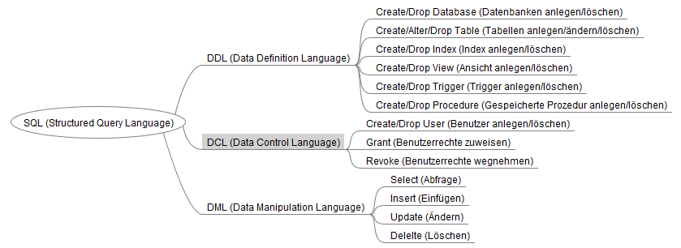

# Datenbanken


## Index

* [Datenbank](#datenbank)
* [Datenbankmanagementsystem](#datenbankmanagementsystem)
* [Tabellen](#tabellen)
* [Datenbank und Benutzer anlegen, Rechte zuweisen](#datenbank-und-benutzer-anlegen-rechte-zuweisen)
* [Structured Querry Language SQL](#structured-querry-language-sql)
* [Erste SQL Kommandos](#erste-sql-kommandos)
* [Daten ändern](#daten-ändern)
* [Rechnen mit Feldern](#rechnen-mit-feldern)
* [Aliasnamen](#aliasnamen)
* [Datenimport über CSV-Datei](#datenimport-über-csv-datei)
* [Where-Clause](#where-clause)
* [Vergleichsoperatoren](#vergleichsoperatoren)
* [Daten sortieren](#daten-sortieren)
* [Aggregatfunktionen](#aggregatfunktionen)
* [Limit](#limit)
* [SQL-Skript im MySQL-Client ausführen](#sql-skript-im-mysql-client-ausführen)
* [Die Tabelle dual](#die-tabelle-dual)
* [Zufallszahlen](#zufallszahlen)
* [NULL-Wert](#null-wert)
* [Daten mit select in Tabelle einfügen](#daten-mit-select-in-tabelle-einfügen)
* [Klonen einer Tabelle](#klonen-einer-tabelle)
* [Primärschlüssel und Auto-Inkrement](#primärschlüssel-und-auto-inkrement)

## Datenbank

+ Tabellen
+ Views
+ Indizes
+ Stored Procedures
+ Trigger

## Datenbankmanagementsystem

+ Verarbeitung
+ Zugriffsrechte
+ Sitzungsverwaltung
+ Transaktionsverarbeitung
+ Datensicherung
+ API (Application Programming Interface)

## Tabellen

| KundenNr | Name          | Ort        |
|----------|---------------|------------|
| 4711     | Müller, Otto  | Tettnang   |
| 4712     | Schmid, Luis  | Ravensburg |
| 4713     | Maier, Martin | Mengen     |

+ __Spalte:__ (Attribut, Datenfeld, Eigenschaft, Property)
  + Beinhaltet Daten desselben Typs (z.B. Zahlen)
  + Beinhaltet Daten derselben logischen Zuordnung (z.B. Name)
  + Haben einen eindeutigen Namen
+ __Zeile:__ (Datensatz, Entität, Record, Objekt)
  + Enthält inhaltlich zusammenhängende Daten
+ __Tabelle:__ (Matrix, Entitätstyp, Relation, Klasse, Recordset)
   + Besteht aus mindestens einer Spalte mit endlich vielen Zeilen (0 bis n Zeilen)

## Datenbank und Benutzer anlegen, Rechte zuweisen

###  Datenbank anlegen

Um eine Datenbank mit dem Namen EST anzulegen, verwenden Sie das folgende Kommando:

```sql
create database EST;
```

### Anlegen eines Benutzers

Außer dem Benutzer root hat in diesem Moment niemand Zugriff auf die neue Datenbank. OK, im Moment gibt es auch nur den einen Benutzer. Dies ist aber auch der Fall, wenn schon weitere Benutzer vorhanden wären.

Im nächsten Schritt erstellen wir einen weiteren Benutzer. Die Benutzerverwaltung unterscheidet sich etwas von anderen Datenbanksystemen. Bei MariaDB besteht ein Benutzer immer aus dem Namen und Netzwerknamen, von wo aus dieser Zugriff haben wird. Getrennt werden die beiden Teile durch den Klammeraffen @. In der Regel werden lokale Benutzer (@localhost) und Benutzer, die Zugriff über das Netzwerk haben (@%) angelegt. Das Prozentzeichen % ist hier der Platzhalter für beliebige Zeichen.

Legen wir einen Benutzer an mit Namen schueler, der lediglich auf dem Datenbankserver direkt Zugriff haben wird:

```sql
create user 'schueler'@'localhost' identified by 'geheim';
```

Achten Sie darauf, die Hochkommas um @ zu beenden, ansonsten wird eine Benutzer mit dem Namen schueler@localhost angelegt. Als Passwort wird hier das Wort geheim gesetzt.

### Vergeben von Rechten

Der neue Benutzer kann nun zwar zur Anmeldung benutzt werden, allerdings verfügt er darüber hinaus über keine Rechte. Wir wollen ihm nun die vollen Zugriffsrechte auf die Datenbank EST geben:

```sql
grant all on EST.* to 'schueler'@'localhost';
```

Zugriff über den neuen Benutzer

Nun können wir uns mit dem neuen Benutzer anmelden und in die Datenbank EST wechseln.

```
mysql -u schueler -p
```

Die Option -p fragt nach dem Kennwort.

```sql
use EST;
```

Mit dem use-Kommando kann in eine Datenbank gewechselt werden. So kann bei allen Zugriffen der Datenbankname weggelassen werden und die Tabellennamen können direkt angegeben werden.

Mit dem Kommando

```sql
show databases;
```

können Sie sich alle Datenbanken anzeigen lassen, auf die Sie Zugriff haben.

### Passwort Ändern

Mit den folgenden Befehlen kann das Passwort eines Benutzers geändert werden.

```sql
ALTER USER 'user'@'hostname' IDENTIFIED BY 'newPassword';
flush privileges;
exit;
```

## Structured Querry Language SQL

SQL (Structured Query Language) ist eine genormte Sprache zur Verarbeitung von Daten in Datenbanksystemen. Die Wurzeln der Sprache liegen bereits in den 1970er Jahren und wurden ursprünglich von IBM entwickelt. Bis heute hat sich SQL stetig weiterentwickelt und ist eine ANSI-Norm. Die meisten DBMS verwenden SQL.



Wie dem Diagramm zu entnehmen ist, gibt es sehr wenige Kommandos (wobei die Liste nicht vollständig ist). Die eigentliche Mächtigkeit liegt allerdings in den Teilkommandos. Hier werden wir nicht alles behandeln können, wir beschränken uns auf die wichtigsten Befehle.

### Allgemeines zu SQL-Befehlen

+ Hilfe im Internet:
    + https://dev.mysql.com/doc/refman/5.7/en/
    + https://mariadb.com/kb/en/library/documentation/
    + https://www.w3schools.com/sql/
+ Bei den Befehlen wird nicht zwischen Groß- und Kleinschreibung unterschieden
+ Bei Namen für Datenbanken, Tabellen, Feldern, … wird zwischen Groß- und Kleinschreibung unterschieden. Es kann also z.B. eine Tabelle TEST und eine Tabelle Test existieren (sollte aber vermieden werden!). Wenn Leerzeichen verwendet werden, dann müssen die Namen in Hochkomma stehen (' oder ").
+ Empfehlungen für Namen: 
    + Halten Sie sich konsequent an Konventionen (z.B. Groß-/Kleinschreibung, deutsch/englisch, Wörter/Abkürzungen).
    + Verwenden Sie keine Leerzeichen oder Umlaute --> "lästig" beim Programmieren, teilweise auch problematisch wegen unterschiedlicher Zeichensätze.
    + Inhalt sollte am Namen erkennbar sein, aber je kürzer desto besser.
+ Die Reihenfolge der Teilkommandos ist fest vorgegeben. (z.B. select XY from ABC where xy > 0).
+ SQL-Kommandos werden mit einem Semikolon ; abgeschlossen.

## Erste SQL Kommandos

### Anmelden an der Datenbank mit dem MySQL-Client

In der Regel greifen spezielle Softwareprodukte (SAP) auf Datenbanken zu, teilweise auch in Form von Web-Seiten (Amazon,...). Es gibt aber in der Regel vom Softwarehersteller des DBMS auch ein kleines Hilfsprogramm, mit dem direkt auf die Datenbank zugegriffen werden kann. So ist es auf bei MariaDB. Um den MySQL-Client zu starten und sich am Datenbankserver anzumelden, verwenden Sie das folgende Kommando:

```
mysql -u USERNAME -p
```

USERNAME steht hier stellvertretend für Ihren Anmeldenamen. Anschließend werden Sie nach dem Passwort gefragt. Wundern Sie sich nicht, wenn die eingegebenen Passwort-Zeichen nicht auf dem Bildschirm angezeigt werden.

Wenn alles richtig eingegeben wurde, dann sollte Sie der Datenbankserver begrüßen. Nun können Sie SQL-Kommandos ausführen.

### Anlegen einer Datenbank

```sql
create database DATENBANKNAME -- (z.B. create database SAP).
```

### Anlegen eines Benutzers und zuweisen von Rechten

```sql
create user 'schueler'@'localhost' identified by 'passwort'; 
grant all on SAP.* to 'schueler'@'localhost';
```

### Nützliches zum mysql-Client

+ Mit den Tasten hoch/runter kann zwischen den letzten Kommandos geblättert werden.
+ Help bzw. help BEFEHL wird die entsprechende Hilfe angezeigt (z.B. help create database).
+ Mit use DATENBANK wird in die gewünschte Datenbank gewechselt - kann auch direkt an den mysql-Aufruf gehängt werden (z.B. mysql DATENBANK).


### Erste hilfreiche Kommandos (teilweise nicht SQL-Standard, sondern speziell für MySQL)

__Alle Datenbanken anzeigen:__
```sql
show databases;
```
 
__Alle Benutzer anzeigen (nur möglich mit root-Rechten):__

```sql
select * from mysql.user;

-- Oder nur Name/Passwort:

select host, user, password from mysql.user;
```
 
__Alle Tabellen anzeigen:__

```sql
show tables;
```
 
__Tabellenstruktur anzeigen:__

```sql
describe TABELLE;
```
 
__Anlegen einer Tabelle:__

```sql
create table artikel (artikelnummer integer, benennung varchar(30));
```
 
__Datensatz in eine Tabelle einfügen:__

```sql
insert into artikel (artikelnummer, benennung) values (1, "Blauer Gummiball");
```
 
__Alle Datensätze einer Tabelle anzeigen:__

```sql
select * from artikel;
```
\* für alle Felder oder Feldnamen mit Komma getrennt.

__Alle Datensätze einer Tabelle löschen:__

```sql
delete from artikel;
```

__Eine Tabelle löschen:__

```sql
drop table artikel;
```

## Daten ändern

```sql
update TABELLENNAME set FELDNAME = wert;
```

Es können auch mehrere Felder mit Komma getrennt angegeben werden.

 
## Rechnen mit Feldern

Mit Felder kann direkt gerechnet werden.

z.B.

```sql
select nr * 2 from nummern;
update arbeiter set gehalt = gehalt + 1000;
```

## Aliasnamen

Tabellen und Feldern können alternative Namen vergeben werden.

z.B. 

```sql
select gehalt - steuern as netto 
    from arbeiter as a;
```

## Datenimport über CSV-Datei

Laden von Daten aus einer strukturierten Datei (z.B. CSV) in eine existierende Tabelle.

```sql
load data local infile 'PFAD/DATEINAME'
    into table TABELLENNAME
    fields terminated by ';'
    enclosed by '"'
    lines terminated by '\n'
    ignore 1 rows;
```

| Syntax | Funktion |
|-|-|
|load data local infile 'PFAD/DATEINAME'|local: Datei befindet sich auf dem Client|
|into table TABELLENNAME|Die Tabelle muss exisitieren|
|fields terminated by ';'|Trennzeichen zwischen den Feldinhalten|
|enclosed by '"'|Daten eingeschlossen in ein Zeichen|
|lines terminated by '\n'|Datensätze sind getrennt durch Zeilenumbruch|
|ignore 1 rows;|1. Zeile überspringen (z.B. bei Titel)|

## Where-Clause

Filtert die betroffenen Daten (select, update, delete). Hinter where steht ein logischer Ausdruck, der datensatzbezogen wahr oder falsch sein kann.

## Vergleichsoperatoren

| Operator | Bedeutung |
| -------- | --------- |
| = | gleich |
| <> | ungleich (bei manchen SQL-Versionen auch !=) |
| > | größer als |
| < | kleiner als |
| >= | größer oder gleich |
| <= | kleiner oder gleich |
| BETWEEN | zwischen (z.B. BETWEEN 10 AND 15) |
| LIKE | Suchmuster (mit Platzhalter % für 0-n Zeichen und _ für 1 exakt Zeichen) |
| IN | Werte in einer Liste (z.B. Ort IN ('New York', 'Rio', 'Tokio')) |

Mit `AND`, `OR` können mehrere logische Ausdrücke verbunden werden.

`NOT` negiert die Logik.

--> siehe Digitaltechnik oder Programmiersprachen

## Daten sortieren

`order by feldname` (oder mehrere Feldnamen mit Komma getrennt)

__z.B.__

```sql
select name, vorname
    from adressen
    order by name, vorname
```

Per Default wir aufsteigend sortiert (Schlüsselwort `ASC`). Soll absteigend sortiert werden, so wird hinter dem Feldnamen das Schlüsselwort `DESC` angegeben.

## Aggregatfunktionen

| Funktion | Bedeutung |
| -------- | --------- |
| count()  | Anzahl    |
| sum()    | Summe     |
| min()    | minimaler Wert |
| max()    | maximaler Wert |
| avg()    | durchschnittlicher Wert |


__Beispiel__

```sql
select count(*)
    from TABELLENNAME
```

um die Anzahl der Datensätze einer Tabelle auszugeben.

### Aggregatfunktionen gruppieren

Mit group by können die Aggregatfunktionen auf Untermengen angewandt werden. Hier werden alle Werte zusammengefasst, deren Gruppenfeld(er) den gleichen Wert haben.

__Beispiel__

```sql
select position, avg(gehalt)
    from mitarbeiter
    group by position;
```

## Limit

### SQL Server / MS Access Syntax:

```sql
SELECT TOP number column_name(s)
    FROM table_name
    WHERE condition;
```
 
### MySQL Syntax:

```sql
SELECT column_name(s)
    FROM table_name
    WHERE condition
    LIMIT number;
```

### Oracle Syntax:

```sql
SELECT column_name(s)
    FROM table_name
    WHERE ROWNUM <= number;
```

## SQL-Skript im MySQL-Client ausführen

```
source <PFAD>/<DATEINAME>;
```

### Direkt beim Aufruf von mysql

```
mysql --user=BENUTZER --password=PASSWORT DATENBANK < PFAD/DATEINAME
```

### Per Kommandozeile SQL-Befehl ausführen

```
echo "select * from tabelle;" | mysql --user=BENUTZER --password=PASSWORT DATENBANK
```

## Die Tabelle dual

Die Tabelle "dual" ist eine virtuelle Tabelle mit einem Datensatz ohne Wert.\ Sie wird verwendet, um Abfragen ohne Tabellenbezug auszuführen, z.B. mathematische Berechnungen.

Beispiele
```sql
select version()
  from dual;

select sin(pi()/2)
  from dual;

select 4 * atan(1)
  from dual;
```

-> bei MySQL: "from dual" nicht nötig!

## Zufallszahlen

Zufall ist für einen Computer sehr schwierig. Letztendlich wird eine "zufällige" Zahl aus einer verfügbaren Tabelle mit "Zufallszahlen" entnommen. Arbeitet man diese "Zufallstabelle" der Reihe nach durch, so würde man bei jedem Durchlauf identische Zufallszahlen bekommen. Die einzige Einflussnahme ist der Offset, also die Stelle, an der man sich in der Zufallstabelle befindet. Sehr gebräuchlich ist hier die aktuelle Uhrzeit (oder Zeit seit Rechnerstart). Da es nahezu unmöglich ist, ein Programm zur exakt gleichen Zeit (bzw. Zeit nach Rechnerstart) aufzurufen, erricht man über einen zeitlich gewählten Offset in der Zufallstabelle eine relative gute "Zufälligkeit". Bei Microcontrollern funktioniert diese Methode in der Regel nicht. Zum einen steht keine aktuelle Uhrzeit zur Verfügung, zum anderen muss kein Betriebssystem geladen werden. Somit startet das Programm exakt zur gleichen Zeit nach dem Einschalten. Hier behilft man sich mit einem unbeschalteten Analogeingang. Da hier der Wert, der sich durch die Analog-Digital-Wandung ergibt, etwas schwankt, kann dies zu einem unterschiedlichen Offset in der Zufallstabelle führen. Verbessert wird dies, indem zusätzlich ein Kabel angeschlossen wird. Dies wirkt als Antenne, was zu einem stärker schwankenden Wert am Analog-Eingang führt.

- Funktion `RAND()`: Liefert einen Wert zwischen 0 (inklusiv) und 1 (exklusiv).
- Als Parameter kann ein Offset in der Wertetabelle angegeben werden.
- Formel zur Berechnung von Zahlen zwischen 2 Werten: \
`FLOOR(RAND()*(max - min + 1) + min);`
- Wird der Parameter angegeben `RAND(SEED)`, dann werden wiederholt die gleichen Zufallszahlen gebildet.

## NULL-Wert

- Ganz wichtiger Wert bei Datenbanken.
- Das Feld hat keinen Inhalt.
- 0 bzw. ein leerer Sting '' sind NICHT NULL!
- Abfrage mit IS NULL bzw. IS NOT NULL.
- create table: NOT NULL hinter Datentyp bedeutet, dass das Feld zwingend einen Wert enthalten muss (Default: NULL - leere Werte sind zulässig).

__Beispiel__

```sql
create table nulltest(nr int not null, text varchar(20));

insert into nulltest(text) values ("Blabla");
-- Führt zu einem Fehler, da das Feld nr nicht leer (NULL) sein darf.

insert into nulltest(nr) values (1);
-- Funktioniert, da das Text-Feld mit NULL (Default) gefüllt werden darf.
```

## Daten mit select in Tabelle einfügen

Anstatt mit `VALUES` eine Datenliste anzugeben, die in eine Tabelle eingetragen werden sollen, können mit `SELECT` Daten aus einer Abfrage anstatt auf dem Bildschirm in eine Tabelle eingefügt werden.

```sql
insert into TABELLE1(FELDNAME1, FELDNAME2)
    select FELD1, FELD2
    from TABELLE2;
```

## Klonen einer Tabelle

In 2 Schritten können Sie eine Tabelle samt Daten kopieren.\
In Schritt 1 wird eine weitere Tabelle mit identischer Struktur angelegt.\
In Schritt 2 werden die Daten kopiert.

```sql
create table TABELLE2 like TABELLE1;
insert into TABELLE2 select * from TABELLE1;
```

## Primärschlüssel und Auto-Inkrement

### Primärschlüssel (Primary Key)

- Ein Feld oder mehrere Felder die (zusammen) einen eindeutigen Schlüssel für jeden Datensatz einer Tabelle ergeben.
- Schlüsselfelder dürfen nicht NULL sein
- Schlüsselwerte müssen eindeutig (unique) sein.

__Beispiel__

```sql
create table KUNDEN (KUNDENNUMMER int primary key, FIRMA varchar(30), ORT varchar(30));

-- oder

create table KUNDEN (KUNDENNUMMER int, FIRMA varchar(30), ORT varchar(30), primary key(KUNDENNUMMER));

-- oder nachträglich:

alter table KUNDEN add primary key(KUNDENNUMMER);
```

### Autoincrement

- Feld dessen Wert sich bei jedem Datensatz erhöht.
- Nur ein Feld je Tabelle möglich.
- Nur beim Primärschlüsselfeld möglich.


__Beispiel__

```sql
create table KUNDEN(KUNDENNUMMER int primary key auto_increment, FIRMA varchar(30), ORT varchar(30));
```
 
Autoincrementwert manuell auf einen Wert setzen

```sql
alter table KUNDEN auto_increment=100;
```