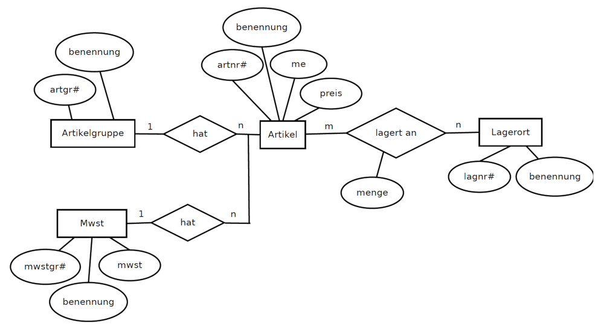

### 1. Analysieren Sie die Datei artikel.sql und führen Sie sie aus.

```sql
source C:/pfad/zu/artikel.sql;
```

```sql
MariaDB [est]> desc artikel;
+-----------+--------------+------+-----+---------+-------+
| Field     | Type         | Null | Key | Default | Extra |
+-----------+--------------+------+-----+---------+-------+
| artnr     | int(11)      | NO   | PRI | NULL    |       |
| benennung | varchar(30)  | NO   |     | NULL    |       |
| artgr     | int(11)      | NO   |     | NULL    |       |
| me        | varchar(2)   | NO   |     | NULL    |       |
| preis     | decimal(6,2) | NO   |     | NULL    |       |
| mwstgr    | int(11)      | NO   |     | NULL    |       |
+-----------+--------------+------+-----+---------+-------+
6 rows in set (0.010 sec)

MariaDB [est]> desc artikelgruppen;
+-----------+-------------+------+-----+---------+-------+
| Field     | Type        | Null | Key | Default | Extra |
+-----------+-------------+------+-----+---------+-------+
| artgr     | int(11)     | NO   | PRI | NULL    |       |
| benennung | varchar(30) | NO   |     | NULL    |       |
+-----------+-------------+------+-----+---------+-------+
2 rows in set (0.008 sec)

MariaDB [est]> desc mwst;
+-----------+---------------+------+-----+---------+-------+
| Field     | Type          | Null | Key | Default | Extra |
+-----------+---------------+------+-----+---------+-------+
| mwstgr    | int(11)       | NO   | PRI | NULL    |       |
| benennung | varchar(30)   | NO   |     | NULL    |       |
| mwst      | decimal(10,0) | NO   |     | NULL    |       |
+-----------+---------------+------+-----+---------+-------+
3 rows in set (0.008 sec)

MariaDB [est]> desc lagerorte;
+-----------+-------------+------+-----+---------+-------+
| Field     | Type        | Null | Key | Default | Extra |
+-----------+-------------+------+-----+---------+-------+
| lagnr     | int(11)     | NO   | PRI | NULL    |       |
| benennung | varchar(30) | NO   |     | NULL    |       |
+-----------+-------------+------+-----+---------+-------+
2 rows in set (0.009 sec)

MariaDB [est]> desc lager;
+-------+---------------+------+-----+---------+-------+
| Field | Type          | Null | Key | Default | Extra |
+-------+---------------+------+-----+---------+-------+
| lagnr | int(11)       | NO   | PRI | NULL    |       |
| artnr | int(11)       | NO   | PRI | NULL    |       |
| menge | decimal(10,0) | NO   |     | NULL    |       |
+-------+---------------+------+-----+---------+-------+
3 rows in set (0.009 sec)
```

### 2. Legen Sie die fehlenden Foreign Keys an.

```sql
alter table artikel
    add constraint fk_artgr
    foreign key (artgr)
    references artikelgruppen(artgr);

alter table artikel
    add constraint fk_mwstgr
    foreign key (mwstgr)
    references mwst(mwstgr);

alter table lager
    add constraint fk_lagnr
    foreign key (lagnr)
    references lagerorte(lagnr);

-- Es müssen die Artikelnummern 1006 und 1007 angelegt werden sonst schlägt fk_artnr fehl

INSERT INTO artikel VALUES 
    (1006, 'Platzhalter1', 1, 'ST', '0.50', 2), 
    (1007, 'Platzhalter2', 1, 'ST', '0.75', 2);

alter table lager
    add constraint fk_artnr
    foreign key (artnr)
    references artikel(artnr);
```

### 3. Erstellen Sie das ERM.



### 4. Erstellen Sie ein Prepared Statement zur Suche in der Tabelle "artikel" nach einer bestimmten Artikelbenennung und der Artikelgruppe.

```sql
PREPARE ein_artikel FROM 
"SELECT * FROM artikel
INNER JOIN artikelgruppen
ON (artikel.artgr = artikelgruppen.artgr)
    WHERE artikel.benennung = ? 
    AND artikelgruppen.benennung = ?";

SET @artgr_name = 'Lebensmittel';
SET @art_name = 'Birne';

EXECUTE ein_artikel USING @art_name, @artgr_name;
```

### 5. Erstellen Sie ein Prepared Statement zur Erhöhung des Lagerbestands in der Tabelle "lager" unter Angabe Artikelnummer, Lagernummer und Einlagermenge.

```sql
PREPARE lagerbestand_erhoehen FROM 
"UPDATE lager SET menge = (menge + ?)
    WHERE artnr = ? AND lagnr = ?";

SET @artnr = 1001;
SET @lagnr = 2;
SET @einlager_menge = 100;

EXECUTE lagerbestand_erhoehen USING @einlager_menge, @artnr, @lagnr;
```