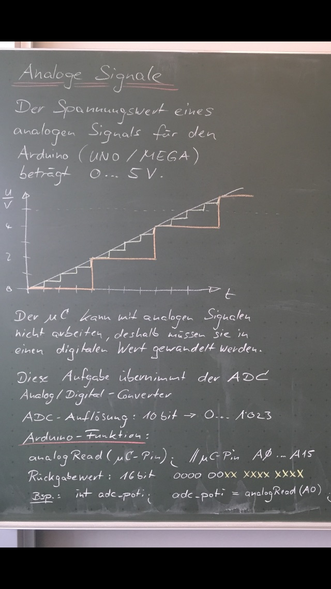

# Microcontroler


## Index

* [Vergleichsoperatoren](#vergleichsoperatoren)
* [Boolsche Operatoren](#boolsche-operatoren)
* [Variablen](#variablen)
* [Arrays](#arrays)
* [Kontrollstrukturen](#kontrollstrukturen)
* [Schleifen](#schleifen)
* [Funktionen](#funktionen)
* [Analoge Signale](#analoge-Signale)

## Vergleichsoperatoren

| Operator | Bedeutung      | Anwendung |
| -------- | -------------- | --------- |
| ==       | Gleichheit     | `a == b`  |
| !=       | Ungleichheit   | `a != b`  |
| <        | echt kleiner   | `a < b`   |
| >        | echt größer    | `a > b`   |
| <=       | kleiner gleich | `a <= b`  |
| >=       | größer gleich  | `a >= b`  |

## Boolsche Operatoren

| Operator | Bedeutung      | Anwendung  |
| -------- | -------------- | ---------  |
| &&       | und            | `a && b`   |
| \|\|     | oder           | `a \|\| b` |
| !        | nicht          | `!a`       |

## Variablen


## Arrays

Ein Array sind mehrere Werte des selben Datentyps, auf sie über einen Index zugegriffen werden kann.

__Bsp.:__ Deklaration eines Arrays

```c
byte mcpin[7] = {2, 3, 4, 5, 6, 7, 8};
```

__Bsp.:__ Zugriff über Index

_Indizes fangen bei 0 an._
```c
byte firstValue = mcpin[0];
```


### 2-dimensionale Arrays


## Kontrollstrukturen

### if-else


Programmcode:

```c
// bedingung muss vom Typ boolean (true/false) sein

if(bedingung) {
    // Aktion 1
}

if(bedingung) {
    // Aktion 1
} else {
    // Aktion 2
}
```

### switch-case


Eine switch-case-Anweisung vergleicht den Wert einer Variablen mit den Werten aus den case-Anweisungen.

Wenn eine Übereinstimmung gefunden wird, wird das Programm ab der jeweiligen case-Anweisung bis zum nächsten `break;` ausgeführt.

Programmcode:

```c
switch(variable) {
    case wert1:
        // Anweisung 1
        break;
    case wert2:
        // Anweisung 2
        break;
    case wert3:
        // Anweisung 3
        break;
    default:
        // Anweisung 4
        break;
}
```


## Schleifen

### while-Schleife


Eine while-Schleife wiederholt den Code innerhalb der geschweiften { } Klammern, bis die Bedingung in den runden Klammern nicht mehr wahr ist.

Um die Schleife zu verlassen, muss der Wert der Bedingung innerhalb der geschweiften { } Klammern geändert werden.

__oder:__ Die Bedingung ist von einem externen Event abhängig z.B.

```c
while(digitalRead(someInput) == HIGH)
```

Programmcode:

```c
while(bedingung) {
    // Schleifenkörper
}
```

### do-while-Schleife


Die do-while-Schleife verhält sich wie die while-Schleife, jedoch wird die Bedingung erst am Ende der Schleife überprüft.\
Die do-while-Schleife wird also immer mindestens 1x durchlaufen.

Programmcode:

```c
do {
    // Schleifenkörper
} while(bedingung)
```

### for-Schleife


Die for-Schleife wird dann benutzt, wenn zu Beginn feststeht wie oft die Schleife durchlaufen werden soll.

Programmcode:

```c
for(byte i=0; i<10; i++) {
    // Schleifenkörper
}

// "byte i=0;" Initialisierung: Startwert festlegen (Variable)
// "i<10;"     Bedingung:       Wann soll die Schleife abgebrochen werden?
// "i++"       Postoperation:   Behandlung des Schleifenzählers 
//                              nach einem Schleifendurchlauf
```


## Funktionen

Eine Funktion ist in der Informatik die bezeichnung eines Programm-Konstrukts, mit dem der Quellcode strukturiert werden kann, so dass Teile der funktionalität des Programms wiederverwendbar sind.

### Aufbau einer Funktion:

void<sup>1</sup> funktionsName<sup>2</sup> (int übergabeWert<sup>3</sup>)

1. Datentyp des return-value (void fals kein wert zurückgegeben wird)
2. Aussagekräftiger Funktionsname
3. Keiner bis beliebig viele Übergabewerte

Beispiele:

```c
// Funktion mit mehreren Übergabewerten
byte funktionsName(int uebergabeWert1, int uebergabeWert2){
    // Code der die Übergabewerte verarbeitet
    
    // Rückgabewert
    return someByte;
}

// Funktion ohne Übergabewerte
int funktionsName(){
    // someCode
    return someInteger;
}

// Funktion ohne return value
void funktionsName(int uebergabeWert){
    // someCode
}
```

## Analoge Signale



### analogRead()

__Beschreibung:__

Liest den angegebenen Analogeingang aus. Der ARDUINO hat einen 6-Kanal (8 beim Mini und Nano, 16 beim Mega) 10-bit ADC, \
dass bedeutet der ARDUINO UNO z.B. wandelt Spannungen von 0V bis 5V in Zahlen von 0 bis 1023 um.\
Bei 5V Referenzspannung ist das eine Auflösung von 5V / 1024 = 0.0049V = 4,9mV.\
Es dauert ungefähr 100µs einen Analogwert zu lesen, somit ergibt sich eine theoretische, maximale Frequenz von 10.000 Abfragen pro Sekunde.

__Syntax:__

```c
analogRead(pin);
```

__Parameter:__\
pin: die Pinnummer des Pins, der konfiguriert werden soll (`A0` bis `A5` bei den meisten Boards, `A0` bis `A7` beim Mini und Nano, `A0` bis `A15` beim Mega)

__Rückgabewert:__\
int (Integer-Wert) zwischen 0 und 1023

__Beispiel:__
```c
int analogPin = 3; // Potentiometer Schleifer am Pin A3
int val = 0;       // Variable um Messergebnis zu speichern

void setup()
{
    Serial.begin(9600); // serielle Kommunikation einschalten
}

void loop()
{
    val = analogRead(analogPin); // Eingang auslesen
    Serial.println(val);         // Messwert über serielle Verbindung senden
}
```

### analogWrite()

__Beschreibung:__\
Gibt eine PWM (Pulsweitenmodulation, Rechteckspannung) am definierten Pin aus. Diese PWM kann z.B. benutzt werden um eine LED zu dimmen oder einen Motor in der Geschwindigkeit zu regeln (natürlich über einen Treiber). Die PWM wird solange ausgegeben bis die Pulsweite durch einen weiteren Aufruf von `analogWrite()` geändert wird oder `digitalWrite()` bzw. `digitalRead()` für diesen Pin aufgerufen wird.

Die PWM-Frequenz liegt beim ARDUINO UNO (und den ATMega328-basierten Boards) bei ca. 490Hz an den Pins 3,9,10,11 und ca. 980Hz an Pins 5 und 6. Diese kann aber auch geändert werden. Die Spannung am Ausgang liegt jedoch immer entweder bei 0V oder 5V.

`analogWrite()` funktioniert nur bei den Pins, die für PWM vorgesehen sind. Das sind im Allgemeinen 3, 5, 6, 9, 10, 11. Es gibt aber noch mehr Möglichkeiten per Software (bei Bedarf im Netz nachlesen)

__Syntax:__
```c
analogWrite(pin, pulsweite);
```

__Parameter:__\
pin: die Pinnummer des Pins, an dem die PWM ausgegeben werden soll\
pulsweite: zwischen 0 und 255

__Beispiel:__
```c
int ledPin = 9;    // LED an Pin 9
int analogPin = 3; // Potentiometer an A3
int val = 0;       // Variable um den Analogwert zu speichern

void setup()
{
    pinMode(ledPin, OUTPUT); // den Pin als Ausgang konfigurieren
}

void loop()
{
    val = analogRead(analogPin);  // Pin A3 lesen
    analogWrite(ledPin, val / 4); // analogRead Werte reichen von 0 bis 1023,
                                  // analogWrite Werte von 0 bis 255
}
```