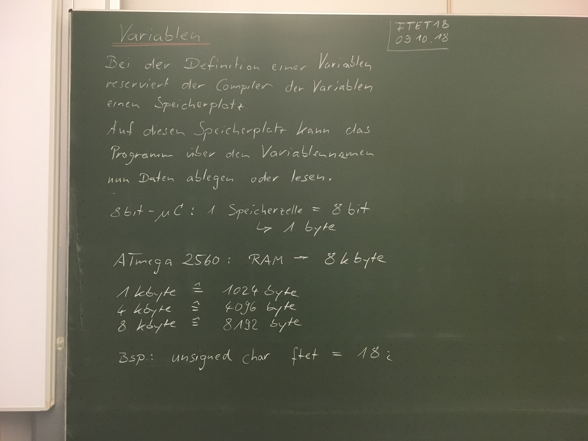
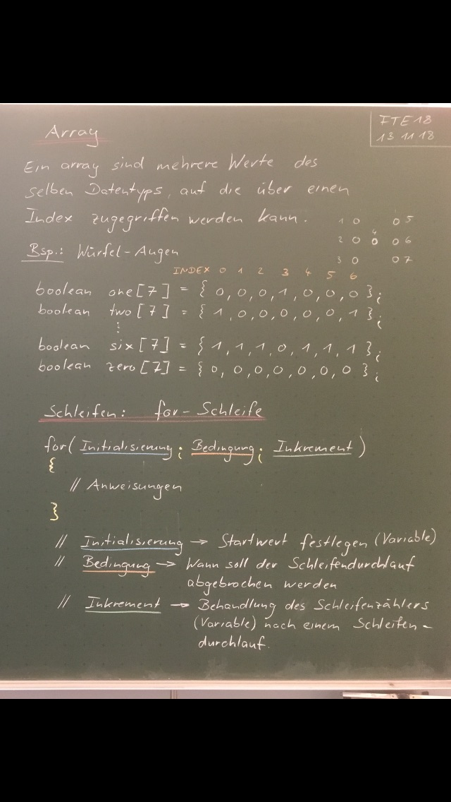
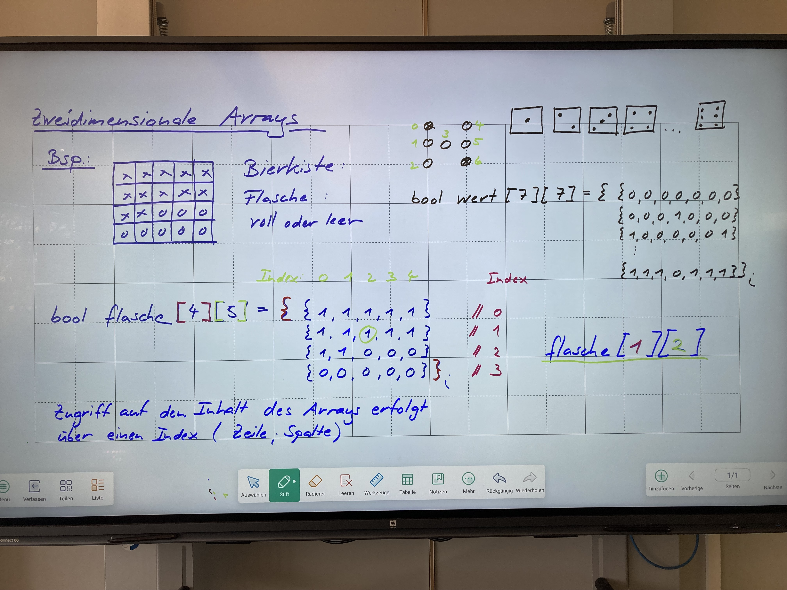
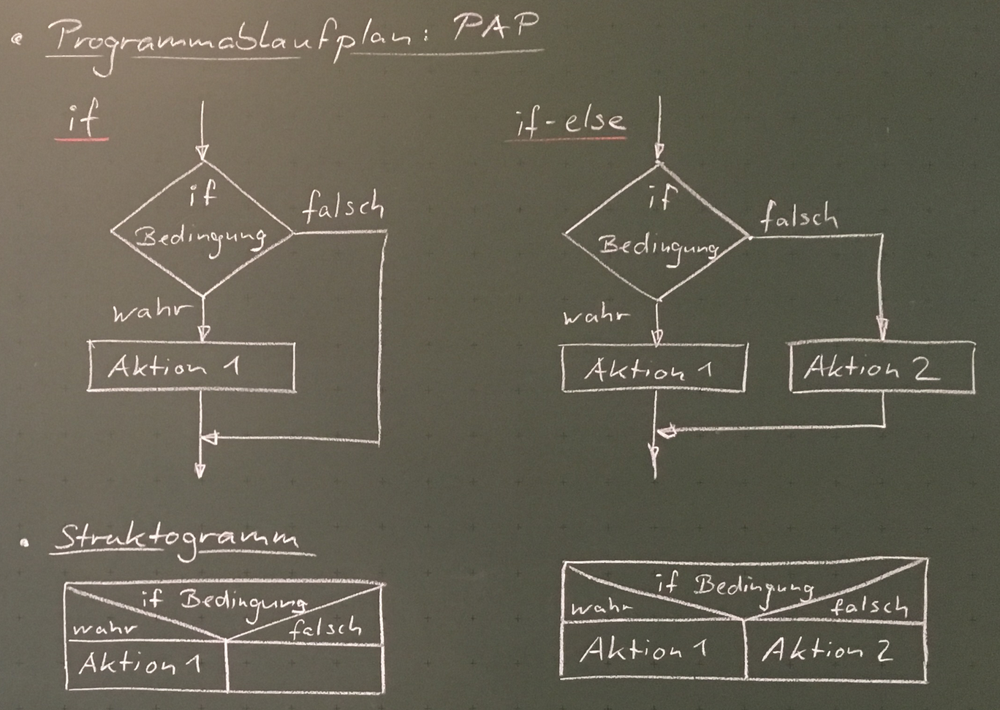
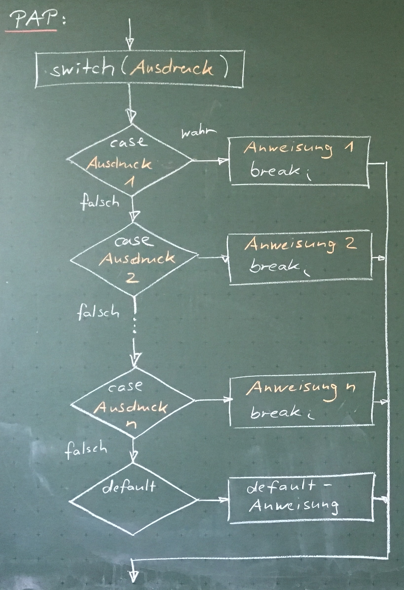
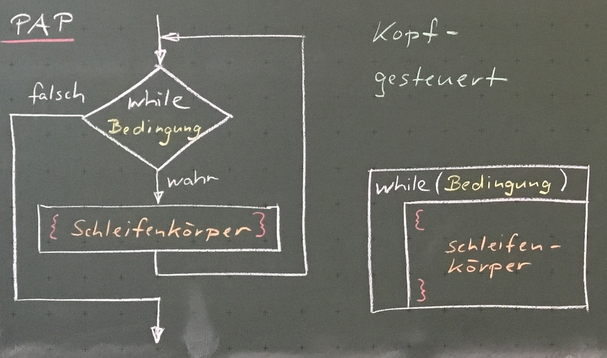
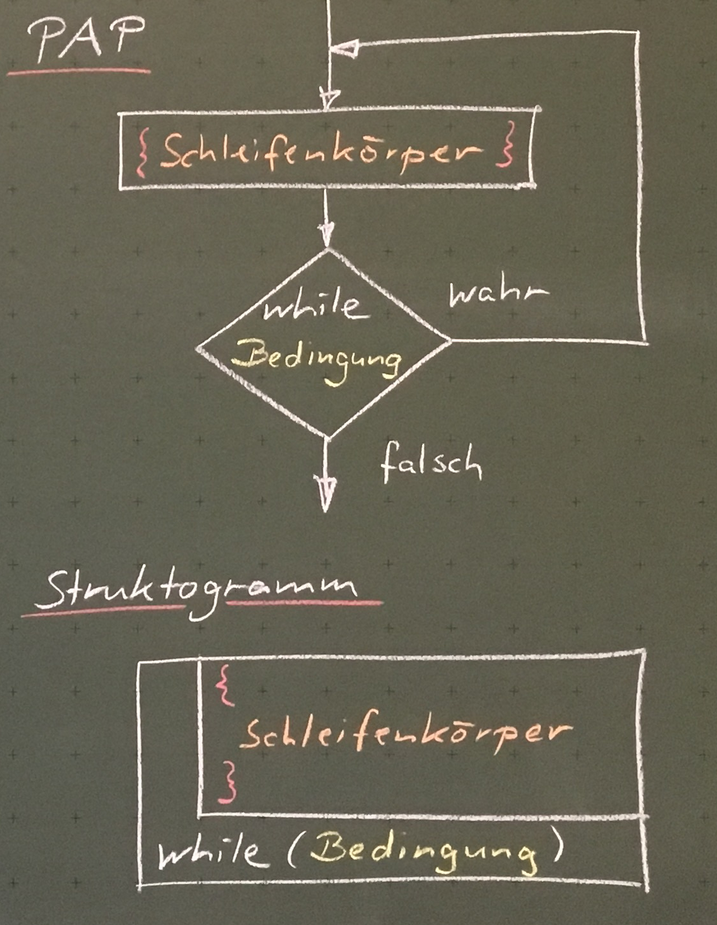
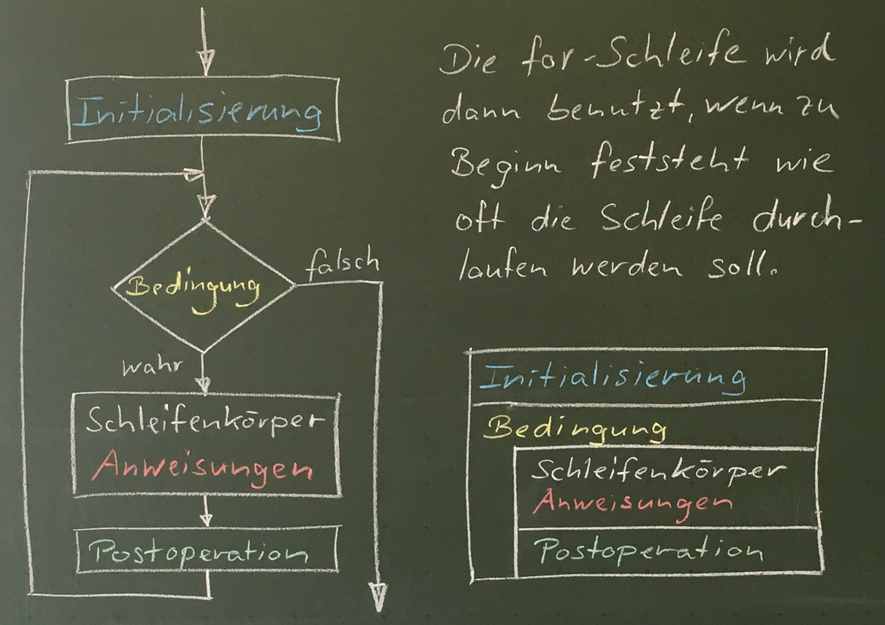

# Microcontroler


## Index

* [Vergleichsoperatoren](#vergleichsoperatoren)
* [Boolsche Operatoren](#boolsche-operatoren)
* [Variablen](#variablen)
* [Arrays](#arrays)
* [Kontrollstrukturen](#kontrollstrukturen)
* [Schleifen](#schleifen)
* [Funktionen](#funktionen)

## Vergleichsoperatoren

| Operator | Bedeutung      | Anwendung |
| -------- | -------------- | --------- |
| ==       | Gleichheit     | `a == b`  |
| !=       | Ungleichheit   | `a != b`  |
| <        | echt kleiner   | `a < b`   |
| >        | echt größer    | `a > b`   |
| <=       | kleiner gleich | `a <= b`  |
| >=       | größer gleich  | `a >= b`  |

## Boolsche Operatoren

| Operator | Bedeutung      | Anwendung  |
| -------- | -------------- | ---------  |
| &&       | und            | `a && b`   |
| \|\|     | oder           | `a \|\| b` |
| !        | nicht          | `!a`       |

## Variablen



## Arrays

Ein Array sind mehrere Werte des selben Datentyps, auf sie über einen Index zugegriffen werden kann.

__Bsp.:__ Deklaration eines Arrays

```c
byte mcpin[7] = {2, 3, 4, 5, 6, 7, 8};
```

__Bsp.:__ Zugriff über Index

_Indizes fangen bei 0 an._
```c
byte firstValue = mcpin[0];
```



### 2-dimensionale Arrays



## Kontrollstrukturen

### if-else



Programmcode:

```c
// bedingung muss vom Typ boolean (true/false) sein

if(bedingung) {
    // Aktion 1
}

if(bedingung) {
    // Aktion 1
} else {
    // Aktion 2
}
```

### switch-case



Eine switch-case-Anweisung vergleicht den Wert einer Variablen mit den Werten aus den case-Anweisungen.

Wenn eine Übereinstimmung gefunden wird, wird das Programm ab der jeweiligen case-Anweisung bis zum nächsten `break;` ausgeführt.

Programmcode:

```c
switch(variable) {
    case wert1:
        // Anweisung 1
        break;
    case wert2:
        // Anweisung 2
        break;
    case wert3:
        // Anweisung 3
        break;
    default:
        // Anweisung 4
        break;
}
```


## Schleifen

### while-Schleife



Eine while-Schleife wiederholt den Code innerhalb der geschweiften { } Klammern, bis die Bedingung in den runden Klammern nicht mehr wahr ist.

Um die Schleife zu verlassen, muss der Wert der Bedingung innerhalb der geschweiften { } Klammern geändert werden.

__oder:__ Die Bedingung ist von einem externen Event abhängig z.B.

```c
while(digitalRead(someInput) == HIGH)
```

Programmcode:

```c
while(bedingung) {
    // Schleifenkörper
}
```

### do-while-Schleife



Die do-while-Schleife verhält sich wie die while-Schleife, jedoch wird die Bedingung erst am Ende der Schleife überprüft.\
Die do-while-Schleife wird also immer mindestens 1x durchlaufen.

Programmcode:

```c
do {
    // Schleifenkörper
} while(bedingung)
```

### for-Schleife



Die for-Schleife wird dann benutzt, wenn zu Beginn feststeht wie oft die Schleife durchlaufen werden soll.

Programmcode:

```c
for(byte i=0; i<10; i++) {
    // Schleifenkörper
}

// "byte i=0;" Initialisierung: Startwert festlegen (Variable)
// "i<10;"     Bedingung:       Wann soll die Schleife abgebrochen werden?
// "i++"       Postoperation:   Behandlung des Schleifenzählers 
//                              nach einem Schleifendurchlauf
```


## Funktionen

Eine Funktion ist in der Informatik die bezeichnung eines Programm-Konstrukts, mit dem der Quellcode strukturiert werden kann, so dass Teile der funktionalität des Programms wiederverwendbar sind.

### Aufbau einer Funktion:

void<sup>1</sup> funktionsName<sup>2</sup> (int übergabeWert<sup>3</sup>)

1. Datentyp des return-value (void fals kein wert zurückgegeben wird)
2. Aussagekräftiger Funktionsname
3. Keiner bis beliebig viele Übergabewerte

Beispiele:

```c
// Funktion mit mehreren Übergabewerten
byte funktionsName(int uebergabeWert1, int uebergabeWert2){
    // Code der die Übergabewerte verarbeitet
    
    // Rückgabewert
    return someByte;
}

// Funktion ohne Übergabewerte
int funktionsName(){
    // someCode
    return someInteger;
}

// Funktion ohne return value
void funktionsName(int uebergabeWert){
    // someCode
}
```