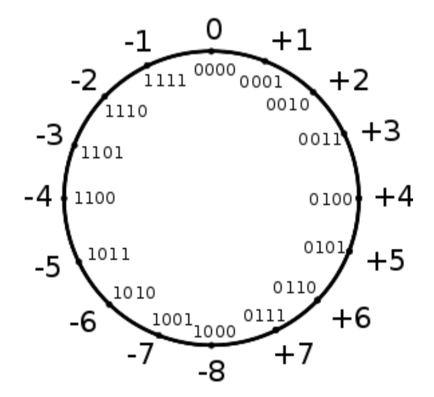
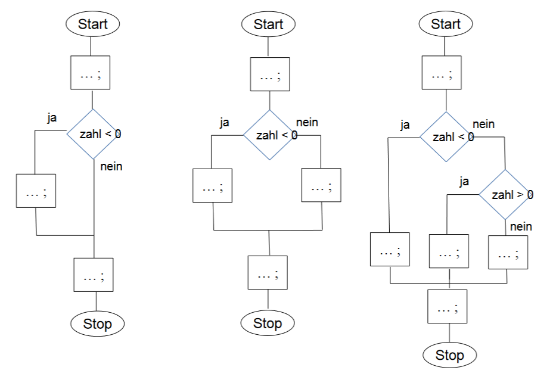
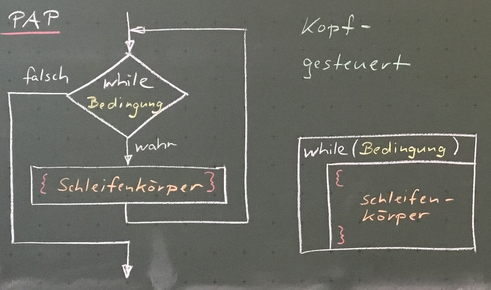
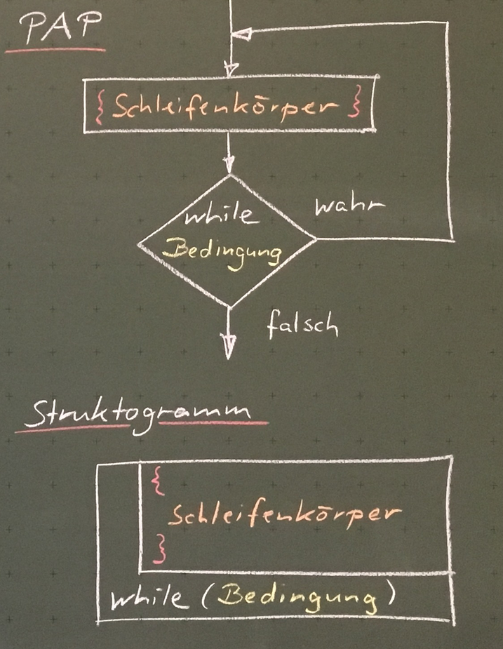
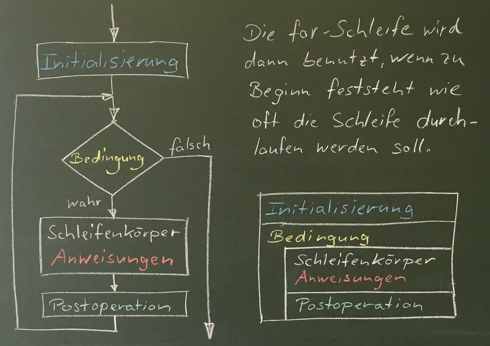

# Software Entwicklung


## Index

* [Hello World](#hello-world)
* [Eingabe über die Tastatur](#eingabe-über-die-tastatur)
* [Variablen](#variablen)
* [Operatoren](#operatoren)
* [Kommentare in Java](#kommentare-in-java)
* [Strings](#strings)
* [Zahlen](#zahlen)
* [Ausgabe am Bildschirm](#ausgabe-am-bildschirm)
* [Verzweigungen](#verzweigungen)
* [Schleifen](#schleifen)
* [Typumwandlung](#Typumwandlung)


## Hello World

### Das Programm "Hello World"

```java
// Klassenname "HelloWorld"
public class HelloWorld {

    public static void main(String[] args) {
        System.out.println("Hello World");
    }
}
```

Öffnen Sie einen Texteditor (z.B. notepad, oder notepadd++) und tippen Sie das Programm. Speichern Sie es unter dem Dateinamen "HelloWorld.java" am besten auf Laufwerk H:. in Ihrem Homeverzeichnis in einem Unterordner "SAE". Achten Sie bei Dateinamen auf Groß- und Kleinschreibung.

Der Dateiname eines Java Quelltexts muss immer gleich lauten wie der Klassenname. Er hat immer die Endung ".java".

### Kompilieren von HelloWorld

Wechseln Sie mit Hilfe der Eingabeaufforderung (cmd) in das Verzeichnis in dem sich Ihr neuer Quelltext befindet.

Kompilieren Sie nun Ihr Programm mit dem Befehl.

```
javac HelloWorld.java
```

Ist das Kompilieren erfolgreich, wird nichts am Bildschirm ausgegeben.

### Betrachten des kompilierten ByteCode

Nun sollte das kompilierte Resultat in Form der Datei "HelloWorld.class" entstanden sein. Öffnen Sie die Datei "HelloWorld.class" mit einem Texteditor und betrachten Sie das Ergebnis. Sie sehen nun den kompilierten Bytecode.

### Starten von "HelloWorld"

Da Ihre "HelloWorld.class" nun durch den Compiler erstellt ist, können Sie Ihr Programm mit Hilfe der Laufzeitumgebung (Java Virtual Machine, kurz "JVM") starten. Dazu geben Sie im Verzeichnis der Datei HelloWorld.class folgenden Befehl ein:

```
java HelloWorld
```

## Eingabe über die Tastatur

```java
/*
Scanner gehört nicht zu den von
Grund auf verfügbaren Klassen.
Scanner muss daher importiert
werden.
*/
import java.util.Scanner;

public class ErsteEingabe {

    public static void main(String[] args) {
        int zahl;
        /*
        Diese Zeile erzeugt eine Variable
        vom Typ Scanner mit dem Namen
        keyboard. Diese stellt die
        Funktionalität zum Einlesen über
        die Tastatur zur Verfügung.
        */
        Scanner keyboardInput = new Scanner(System.in);

        System.out.println("Bitte gib eine Zahl ein:");
        /*
        Hier erfolgt das eigentliche Einlesen
        der Eingabe über die Tastatur. Das
        Programm wird angehalten und
        wartet auf die Benutzereingabe.
        */
        zahl = keyboardInput.nextInt();

        System.out.println("Deine eingegebene Zahl lautet: " + zahl);

        keyboardInput.close();
    }

}
```

### Varianten für verschiedene Datentypen:

```java
int ganzezahl = keyboardInput.nextInt();     // Liest eine ganze Zahl 
                                             // von der Tastatur ein.
                                             
double komma  = keyboardInput.nextDouble();  // Liest eine Dezimalzahl
                                             // von der Tastatur ein.
                                             // Das Komma muss bei einem
                                             // auf deutsch eingestelltem
                                             // Betriebssystem mit Komma
                                             // anstatt Punkt eingegeben
                                             // werden.
                                             
String zeile  = keyboardInput.nextLine();    // Liest eine Zeile Text 
                                             // von der Tastatur ein.
                                             
String wort   = keyboardInput.next();        // Liest ein Wort 
                                             // von der Tastatur ein.
                                             
boolean wert  = keyboardInput.nextBoolean(); // Liest true oder false 
                                             // von der Tastatur ein.
```

### Sonderfall:

Wird nach dem Einlesen einer Zahl `nextLine()` aufgerufen, so liest `nextLine()` das nochnichtgelesene Newline-Zeichen der Zahleingabe.

```java
int zahl = keyboard.nextInt();      // Die Zahl wird ohne Newline gelesen
keyboard.nextLine();                // Newline der Zahleingabe wird gelesen
String zeile = keyboard.nextLine(); // Die Zeile Text kann gelesen werden
```

## Variablen

Eine Variable ist ein Container in dem Daten während der Laufzeit des Programms gespeichert werden kann.

In Java hat eine Variable folgende Eigenschaften:

* __Typ:__ z.B. Zahl oder Text. Eine Liste mit Grundtypen in Java findet sich unten.
* __Name:__ unter diesem Namen kennt der Compiler die Variable. Es sollten nur sinnvolle Namen verwendet werden.
* __Wert:__ der Inhalt den man speichern möchte. Der Inhalt muss zum Typ passen!

| Typ     | Beschreibung          | Größe              | Wertebereich                                               | Literal |
| ------- | --------------------- |------------------- | ---------------------------------------------------------- |-------- |
| int     | ganze Zahl            | 4 Byte             | -2<sup>31</sup> bis 2<sup>31</sup>                         | 34      |
| double  | Zahl mit Komma        | 8 Byte             | &#177;1.4\*10<sup>-45</sup> bis &#177;3.4\*10<sup>38</sup> | 2.6     |
| char    | Ein einzelnes Zeichen | 2 Byte             | Unicode Tabelle                                            | 'F'     |
| String  | Eine Zeichenkette     | 2 Byte pro Zeichen | Unicode Tabelle                                            | "Hello" |
| boolean | Ein Wahrheitswert     | 1-4 Byte           | `true` oder `false`                                        | `true`  |

### Variablen definieren:

z.B. Definieren einer Integer Variable:

```java
int zahl;
```

### Werte zuweisen:

```java
zahl = 3;
```

### Abkürzung (Definition und Zuweisung in einem):

```java
int zahl = 3;
```

### weitere Beispiele:

```java
String text = "HelloWorld";
boolean volljährig = true;
char zeichen = 'x';
double geldbetrag = 3.99;
```

## Operatoren

### Arithmetische Operatoren:

Arithmetische Operatoren sind binäre Operatoren, welche immer mit zwei Operanden arbeiten und bei denen immer die Punkt-vor-Strich-Regel gilt.

| Operator | Verhalten            |
|----|----------------------------|
| \+ | Addition                   |
| \- | Subtraktion                |
| \* |Multiplikation              |
| /  | Division                   |
| %  | Modulo (Rest der Division) |

### Zuweisungsoperator (=):

```java
zahl = 5;
```

Der Zuweisungsoperator weist der Variable auf der linken Seite, den Ausdruck auf der rechten Seite zu.\
Dabei wird der Ausdruck auf der rechten Seite vor der Zuweisung zuerst ausgewertet.

Ein Ausdruck kann aus Variablen oder Werten bestehen.

__Beispiele (Zuweisung von Werten):__

```java
zeichen = 'A';
text = "Hallo";
kommazahl = 3.44;
i = i + 1;
```

__Allgemein:__

```java
variable = anderevariable + 3;
```

### Inkrement- und Dekrementoperatoren (++,--):

Inkrement- und Dekrementoperatoren sind _unär_ und erhöhen bzw. erniedrigen den Wert einer Variablen um eins.

```
++zahl oder zahl++ Addition
--zahl oder zahl-- Subtraktion
```

__Beispiel:__

```java
int zahl = 5;
System.out.println(++zahl); // Ausgabe: 6
System.out.println(zahl++); // Ausgabe: 5
```

### Spezialfall Integerdivision:

```java
double zahl = 3.0 / 2.0; // Zahl hat den Wert 1.5
int zahl = 3 / 2;        // Zahl hat den Wert 1. Das Ergebnis 1.5 wird abgerundet.
```

### Spezialfall Modulo:

Der Modulo-Operator (%) ermittelt den Rest der Division.

__Beispiele:__

```java
10 % 3     // hat den Wert 1 , da 10 : 3 = 3 Rest 1
11 % 3     // hat den Wert 2 , da 11 : 3 = 3 Rest 2
2 % 3      // hat den Wert 2 , da  2 : 3 = 0 Rest 2
10.1 % 3.1 // hat den Wert 0.8 , da 10,1 : 3,1 = 9,3 Rest 0,8
```

## Kommentare in Java

Es gibt in Java ein- und mehrzeilige Kommentare:

__Einzeiliger Kommentar:__ Text, der im Programmcode hinter einem // steht bis zum Zeilenende.\
__Mehrzeiliger Kommentar:__ Alles was zwischen den Zeichenfolgen /* und */ steht, auch über mehrere Zeilen.

__Beispiel:__

```java
// Author: Max Mustermann
// Datum: 09.10.2015
public class HelloWorld {
    public static void main(String[] args) {
        int i = 2;
        i = i * 5; // In dieser Zeile wird i mit 5 multipliziert.
        i++;       // In dieser Zeile wird i um eins erhöht.
        
        /* Der folgende Abschnitt ist noch nicht fertig.
        System.out.println(i);
        i++;
        */
    }
}
```

## Strings

String ist ein Variablentyp, der Zeichenketten als Werte speichern kann.

```java
public class StringsAufgaben {

    public static void main(String[] args) {
        String text;
        text = "Hello World";
        System.out.println(text);

        String stundenplan;
        stundenplan = "1.\tSAE\n2.\tSAE\n3.\tBWL\n4.\tBWL\n5.\tWI\n6.\tREL";
        System.out.println(stundenplan);

        // Aneinanderhängen von beliebig vielen Zeichenketten (Der + Operator)
        String vname = "Vorname";
        String nname = "Nachname";
        String ausgabe = vname + " " + nname;
        System.out.println(ausgabe);
    }
}
```

### Methoden des String-Objekts:

Eine String-Variable ist kein primitiver Datentyp sondern ein Objekt. Sie besitzt nicht nur einen Wert (die Zeichenkette), sondern auch Methoden um bestimmte Eigenschaften dieser Zeichenkette zu ermitteln oder die gespeicherte Zeichenkette zu verändern.

### Die length-Methode: Länge einer Zeichenkette ermitteln:

```java
String text = "Hello World";
int laenge = text.length();
System.out.println("Der Text ist " + laenge + " Zeichen lang.");
```

### Die charAt-Methode: Zeichen an einer bestimmten Position ermitteln:

Die Zeichen in einer Zeichenkette sind mit einem Index durchnummeriert, beginnend bei 0.

|H |e |l |l |o |  |W |o |r |l |d |
|--|--|--|--|--|--|--|--|--|--|--|
|0 |1 |2 |3 |4 |5 |6 |7 |8 |9 |10|


```java
String text = "Hello World";
char zeichen = text.charAt(4);
System.out.println("Das ermittelte Zeichen lautet " + zeichen + ".");
```

### Die substring-Methode: Einen Teil der Zeichenkette ermitteln:

```java
String text = "Hello World";
String erstesWort = text.substring(0, 5); // Ermittelt die Zeichen 0 bis 4
String zweitesWort = text.substring(6, 11); // Ermittelt die Zeichen 6 bis 10
```

Der Startindex ist mit dabei, der Endindex nicht mehr.

### Die replace-Methode: Ein Zeichen in der Zeichenkette ersetzen:

```java
String text = "Hello World";
String neuerText = text.replace('W','w');
System.out.println(neuerText);
```

## Zahlen

### Datentypen für ganze Zahlen

| Typ          | Größe im Hauptspeicher | Wertebereich | Beispielliteral |
|--------------|------------------------|--------------|-----------------|
| `byte`       | 1 Byte         | -128 bis +127 | `34` |
| `short`      | 2 Bytes        | -32768 bis +32767 |`34` |
| `int`        | 4 Bytes        | -2.147.483.648 bis +2.147.483.647 | `34` |
| `long`       | 8 Bytes        | -9.223.372.036.854.775.808 bis +9.223.372.036.854.775.807 | `34l` oder `34L`
| `BigInteger` | mind. 24 Bytes | -2<sup>2.147.483.647</sup> bis +2<sup>2.147.483.647</sup> | - |

### Kodierung negativer Zahlen - Zweierkomplement

Negative Zahlen werden in Zweierkomplementdarstellung gespeichert.

__Ein Beispiel: Die Zahl -23 kann mit einem Byte gespeichert werden:__

1. Positive Zahl bitweise aufschreiben: +23 entspricht binär 0001 0111.
2. Binäre Zahl invertieren (jedes Bit wird umgedreht): 1110 1000.
3. Eins hinzuaddieren: 1110 1000 + 0000 0001 = 1110 1001

__Merke:__

+ Führende Nullen einer positiven Zahl ändern deren Wert nicht.
+ Führende Einsen einer negativen Zahl im Zweierkomplement ändern deren Wert nicht.
+ Negative Zahlen können mit der Zweierkomplementbildung wieder in positive Zahlen überführt werden.

__So liegen 4 Bit Zahlen im Zweierkomplement im Speicher:__



### Datentypen für Dezimalzahlen (Kommazahlen)

__Man unterscheidet:__

+ Gleitkommazahlen: Die Anzahl der Vorkomma- und Nachkommastellen ist variabel. Das Komma wandert bei höheren Werten von links nach rechts, um mehr Vorkommastellen zur Verfügung zu haben. Dadurch verliert man Nachkommastellen für die Genauigkeit.
+ Festkommazahlen: Die Anzahl der Vorkomma- und Nachkommastellen ist fest. Der Speicherplatzbedarf ist größer.

### Gleitkommazahlen

__Datentypen in Java:__

| Typ          | Größe im Hauptspeicher | Wertebereich | Beispielliteral |
|--------------|------------------------|--------------|-----------------|
| `float`      | 4 Bytes | -3,4\*10<sup>38</sup> bis +3,4\*10<sup>38</sup> | `5.2f` oder `5.2F` |
| `double`     | 8 Bytes | -1,7\*10<sup>308</sup> bis +1,7\*10<sup>308</sup> | `5.2` |

__Gleitkommazahlen im Speicher sind folgendermaßen aufgebaut:__

+ Vorzeichenbit: 0 = positiv, 1 = negativ
+ Mantisse: geltende Ziffern
+ Exponent: Verschiebung des Kommas

_Geltende Ziffern_ sind alle von `Null` verschiedenen Ziffern sowie Zwischen- und Endnullen. Dabei wird dasKomma nicht beachtet.

+ __float:__ Vorzeichenbit + 8 Bits Exponent + 23 Bit Mantisse
+ __double:__ Vorzeichenbit + 11 Bits Exponent + 52 Bit Mantisse

Gleitkommazahlen sollten wegen ihren Ungenauigkeiten nicht für Geldbeträge verwendet werden.

__Testen Sie folgenden Code:__ 

```java
System.out.println(0.1 + 0.2);
```

### Festkommazahlen

Das Komma ist hier immer an der gleichen Stelle. Java bietet dafür den Datentyp BigDecimal. Es können beliebig große Zahlen, mit beliebiger Genauigkeit dargestellt werden, bis der Hauptspeicher voll ist. Die zwingend notwendige Genauigkeit bei Berechnungen, z.B. zwei Nachkommastellen für Geldbeträge, kann angegeben werden.

## Ausgabe am Bildschirm

```java
System.out.print("Mein Text");         // Erzeugt die Ausgabe "Mein Text"
                                       // (ohne die Anführungszeichen).

System.out.println("Mein Text");       // Genau wie print, aber fügt am Ende 
                                       // einen Zeilenumbruch hinzu.

System.out.print("Ergebnis: " + zahl); // Mit einem + Zeichen können zwei Texte
                                       // zusammengehängt werden.
                                       // Z.B. der Text „Ergebnis“ und 
                                       // der Inhalt der Variablen zahl
```

### Ausgabe von Sonderzeichen – Escape Sequenzen

<s>System.out.print("Der heutige Tag ist "Samstag"");</s>

Die Anführungszeichen um das Wort Samstag herum haben für den Compiler bereits die Bedeutung, dass eine Zeichenkette anfängt bzw. aufhört. Sie können deshalb im Ausgabetext nicht verwendet werden.

Man muss für bestimmte Sonderzeichen daher eine Escapesequenz verwenden. Diese besteht aus einem Backslash und einem zusätzlichen Zeichen:

```java
System.out.print("Der heutige Tag ist \"Samstag\"");
```

**Wichtige Escape-Sequenzen für die Ausgabe von Sonderzeichen:**

+ \\" Anführungszeichen
+ \\' Hochkomma
+ \\n Zeilenumbruch
+ \\t Tabulator
+ \\\\ Ein einziger Backslash

## Verzweigungen

### if-else

__Drei verschiedene Möglichkeiten zur Verwendung einer Verzweigung in Java__



```java
if (zahl < 0) {
    System.out.println("negativ");
}
```

```java
if (zahl < 0) {
    System.out.println("negativ");
} else {
    System.out.println("nicht negativ");
}
```

```java
if (zahl < 0) {
    System.out.println("negativ");
} else if (zahl > 0) {
    System.out.println("positiv");
} else {
    System.out.println("muss also 0 sein");
}
```

### Vergleichsoperatoren:

```
== Gleichheit               Beispiel: if (zahl == 5)
!= Ungleichheit             Beispiel: if (zahl != 5)
<  kleiner als              Beispiel: if (zahl < 5)
<= kleiner als oder gleich  Beispiel: if (zahl <= 5)
>  größer als               Beispiel: if (zahl > 5)
>= größer als oder gleich   Beispiel: if (zahl >= 5)
```

__Sonderfall Strings vergleichen:__

```java
if (text1.equals(text2))
```

__Merke:__
+ Hinter jedem `if/else` kommt ein Anweisungsblock der zwischen geschweiften Klammern steht.
+ Hinter einem `if/else` kommt kein Semikolon.

### switch-case

Eine switch-case-Anweisung vergleicht den Wert einer Variablen mit den Werten aus den case-Anweisungen.

Wenn eine Übereinstimmung gefunden wird, wird das Programm ab der jeweiligen case-Anweisung bis zum nächsten `break;` ausgeführt.

Programmcode:

```java
switch(variable) {
    case wert1:
        // Anweisung 1
        break;
    case wert2:
        // Anweisung 2
        break;
    case wert3:
        // Anweisung 3
        break;
    default:
        // Anweisung 4
        break;
}
```

## Schleifen

### while-Schleife



Eine while-Schleife wiederholt den Code innerhalb der geschweiften { } Klammern, bis die Bedingung in den runden Klammern nicht mehr wahr ist.

Um die Schleife zu verlassen, muss der Wert der Bedingung innerhalb der geschweiften { } Klammern geändert werden.

Programmcode:

```java
while(bedingung) {
    // Schleifenkörper
}
```

### do-while-Schleife



Die do-while-Schleife verhält sich wie die while-Schleife, jedoch wird die Bedingung erst am Ende der Schleife überprüft.\
Die do-while-Schleife wird also immer mindestens 1x durchlaufen.

Programmcode:

```java
do {
    // Schleifenkörper
} while(bedingung)
```

### for-Schleife



Die for-Schleife wird dann benutzt, wenn zu Beginn feststeht wie oft die Schleife durchlaufen werden soll.

Programmcode:

```java
for(int i=0; i<10; i++) {
    // Schleifenkörper
}

// "int i=0;"  Initialisierung: Startwert festlegen (Variable)
// "i<10;"     Bedingung:       Wann soll die Schleife abgebrochen werden?
// "i++"       Postoperation:   Behandlung des Schleifenzählers 
//                              nach einem Schleifendurchlauf
```

### `break` und `continue`

Wird die Anweisung `break` innerhalb einer Schleife notiert, so bewirkt sie, dass deren Ausführung an dieser Stelle beendet und die Programmausführung sofort nach der Schleife fortgesetzt wird. Das folgende Beispiel demonstriert dies.

Beispiel:
```java
int i = 0;
while (i < 5) {
    if (i == 2) {
        break;
    }
    System.out.println(i++);
}

/* Der Output dieser Schleife wäre:
0
1
*/
```

Die Anweisung `continue` bewirkt im Gegensatz zum break, dass lediglich der aktuelle Schleifendurchlauf (und nicht die vollständige Schleife!) an der Stelle der Anweisung verlassen und der Programmablauf dann mit dem nächsten Schleifendurchlauf fortgesetzt wird. 

Beispiel:
```java
int i = 0;
while (i < 5) {
    if (i == 2) {
        i++;
        continue;
    }
    System.out.println(i++);
}

/* Der Output dieser Schleife wäre:
0
1
3
4
*/
```

## Typumwandlung

### Implizite Typumwandlung (der kleinere Wertebereich ist im größeren enthalten)

`char` → `int` → `long` → `float` → `double`

__Beispiele:__

```java
int zeichen = '1';     // char wird automatisch in int umgewandelt
double kommazahl = 49; // int wird automatisch in double umgewandelt
double kommazahl2 = 49.0F;
```

### Ansonsten: Explizite Typumwandlung mit cast-()-Operatoren

__Compiler-Fehler:__ incompatible types: possibly lossy conversion

`double` → `float` → `long` → `int` → `char`

__Beispiele:__

```java
int zahl = (int) 49.7;          // der cast-Operator rundet ab
float kommazahl = (float) 49.7; // double muss in float gecastet werden
long zahl2 = (long) 49.7F;      // float zu long wird abgerundet
char zeichen = (char) 100000;   // Überlauf: zeichen = 100000 – 65536
int zahl3 = (int) 49L;          // long zu int muss gecastet werden
```

### Ansonsten: Explizite Typumwandlung mit Methoden

`String` → `int`, `String` → `long`, `String` → `float`, `String` → `double`

```java
int zahl = Integer.parseInt("49");
double kommazahl = Double.parseDouble("49.0");
```

`int` → `String`, `long` → `String`, `float` → `String`, `double` → `String`

```java
String textFromInt = String.valueOf(49);
String textFromDouble = String.valueOf(49.0);
String textFromChar = String.valueOf('1');
```